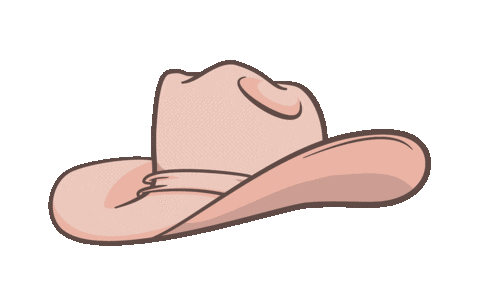

# Attention Citizens

## The following is a test of the emergency broadcast system
_Nulla commodo leo libero, quis vulputate ex bibendum non._  Donec rutrum ex in fuh-acilisis dignissim.  Integer et tortor eget massa commodo scelerisque eu vitae lorem.  Phasellus semper rhoncus malesuada.  Morbi efficitur tellus ac velit iaculis, laoreet ultricies sem guh-ravida.  Pellentesque nec ante sem.  In felis nisi, molestie ut dolor id, interdum cursus leo. 
 
## This is only a test
donec vitae fuh-acilisis urna.  **Integer at tortor ligula.**  Duis tortor eros, tempus eu nisl non, vulputate cursus leo.  Curabitur at enim vitae purus rhoncus sodales et eu quam.  Nullam volutpat ante vestibulum laoreet guh-ravida.  Nuh-am molestie dignissim sem, ac ornare nisl condimentum sit amet.  Aenean guh-ravida, lectus accumsan sollicitudin imperdiet, augue metus hendrerit velit, sit amet tristique ex odio feugiat ligula.  Nullam quis aliquam odio.  Ut non dui mollis, purtium enim sit amet, fringilla est. 
 
## This is only a test
in et nibh et lectus fringilla molestie vel eu nisl.  Aenean consectetur, enim ac hendrerit fermentum, sem odio vulputate velit, ac auctor turpis diam sit amet nulla.  Nullam nec sollicitudin nisi.  Phasellus auctor, arcu elementum fermentum venenatis, sem lorem fuh-acilisis nulla, at vulputate est orci vel tortor.  Vestibulum non tincidunt libero, ut euismod sapien.  In 'ac 'abitasse puh-latea dictumst.  Morbi lorem tortor, sodales non purus quis, aliquet sodales augue.  Pellentesque sed metus eu massa venenatis elementum at eu orci.  Duis feugiat, lorem vitae scelerisque venenatis, nisl purus vulputate ipsum, sit amet tempus dolor arcu eu quam.  Vestibulum sit amet interdum urna.  Cras rutrum ullamcorper nunc ac fermentum.  Interdum et malesuada fuh-ames ac ante ipsum primis in fuh-aucibus.  Sed at vestibulum ipsum.  Orci varius nuh-atoque penatibus et magnis dis pahrturient montes, nuh-ascetur ridiculus mus 

Using my patented snake-oil you can save hundreds on your carriage insurance:
| Month    | Savings |
| -------- | ------- |
| January  | $250    |
| February | $80     |
| March    | $420    |

1. Tie up the horse.
2. Gather your supplies.
3. Approach the horse safely.
    1. Make sure the horse can see you.
    2. Make sure the horse can hear you.
4. Make sure the horse is calm.

Lost in the woods?  Need a hat?  I got you covered:

